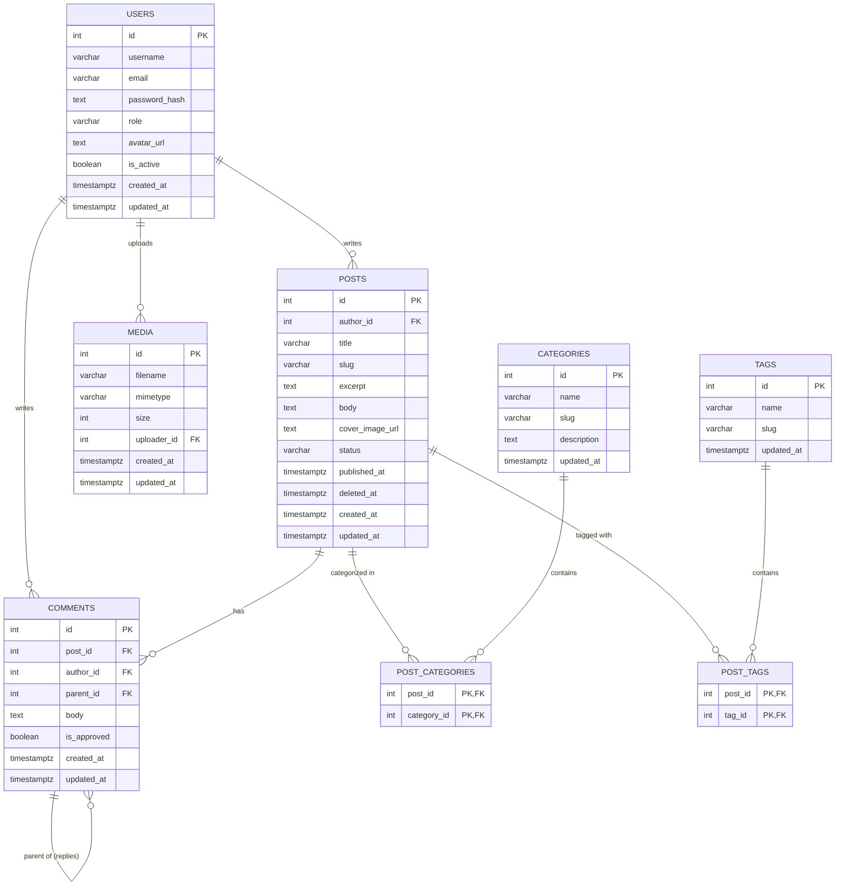

# Database E-R Diagram

This diagram shows the structure of your PostgreSQL database and how the different tables are related to each other.

## Table Breakdown

### 👤 Users
The core table for authentication and profile management.
*   **Roles:** Defaults to 'author', but can be changed to 'admin'.
*   **Security:** Passwords are stored as hashes (never plain text).

### 📝 Posts
Contains the actual blog content.
*   **Relationship:** Every post belongs to one user (`author_id`).
*   **Slug:** Used for SEO-friendly URLs (e.g., `/posts/my-awesome-blog`).

### 📂 Categories & Tags
Used for organizing content.
*   **Many-to-Many:** Since a post can have many tags, and a tag can belong to many posts, we use "junction tables" (`post_categories` and `post_tags`) to link them.

### 💬 Comments
Allows user interaction.
*   **Threaded Replies:** The `parent_id` column allows a comment to "point" to another comment, creating a reply thread.
*   **Anonymous/User:** Linked to `author_id` if logged in.

### 🖼️ Media
Tracks uploaded files (images, etc.).
*   **Relationship:** Tracks which user uploaded which file via `uploader_id`.
